# Data Engineering Spotify Analysis Project
## 🔬 Overview
This is an end-to-end data engineering project:
- Transform data
- Storage data
- Perform analysis on the Spotify data based on the albums, the artists and the tracks metrics.

## 💡 Project Goals
1. Data Ingestion — Build a mechanism to ingest data from different sources.
2. Data Preprocessing — Remove unnecessary properties, replace null value, rename properties.
3. Data lake — We will be getting data from multiple sources so we need centralized repo to store them.
4. ETL System — We are getting data in raw format, transforming this data into the proper format
5. Cloud — Using AWS
6. Reporting — Build a dashboard to get answers to the question we asked earlier(Update later)

## 🛠️ Services we will be using
1. Amazon S3: Amazon S3 is an object storage service that provides manufacturing scalability, data availability, security, and performance.
2. AWS IAM: This is nothing but identity and access management which enables us to manage access to AWS services and resources securely.
3. AWS Glue: A serverless data integration service that makes it easy to discover, prepare, and combine data for analytics, machine learning, and application development.
4. AWS Athena: Athena is an interactive query service for S3 in which there is no need to load data it stays in S3.

## 🗃️ Dataset Used
- This dataset contains the details of albums, track, artist on the Spotify Music App in 2023. This dataset is created using data sourced from Spotify and adheres to their Terms of Use. The dataset is intended for non-commercial, academic purposes and does not infringe upon Spotify's intellectual property rights.

- spotify-albums_data_2023.csv: Contains details about the Albums of artist.
- spotify_artist_data_2023.csv: Include artist names, genres, nationalities, popularity metrics (e.g., follower count, streams), and potentially links to their music.
- spotify_tracks_data_2023.csv: Contains details about individual songs, such as titles, release dates, album information, and audio features...

Access the link here: [Spotify Dataset 2023](https://www.kaggle.com/datasets/tonygordonjr/spotify-dataset-2023/data)

## 📝 Architecture Diagram
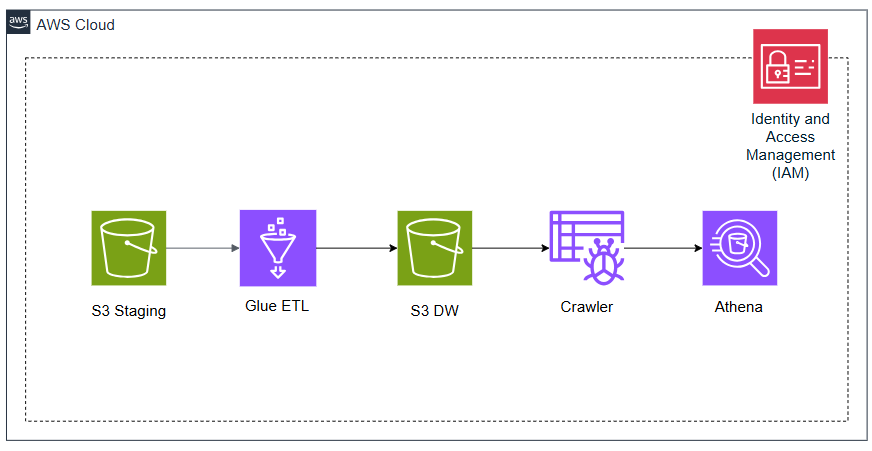

1. Create S3 bucket include S3 staging and S3 datawarehouse.
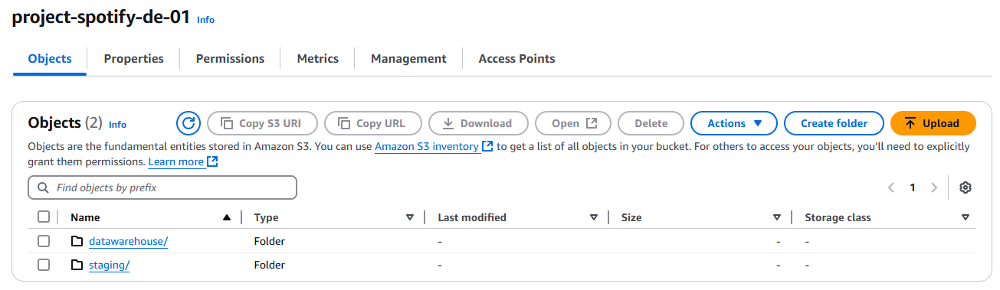
- S3 staging: Storage raw data.
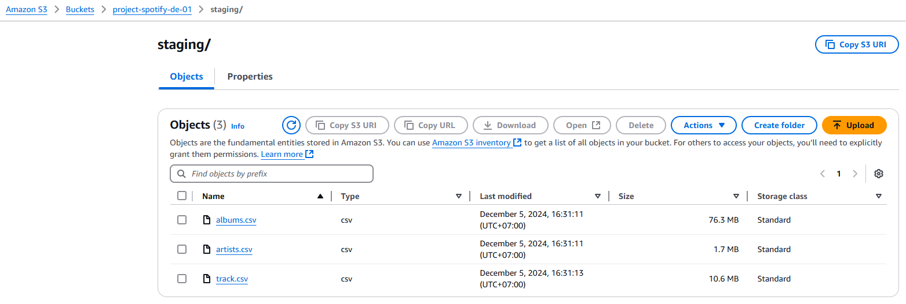
- S3 datawarehouse: Storage transformed data and using this data to analysis.
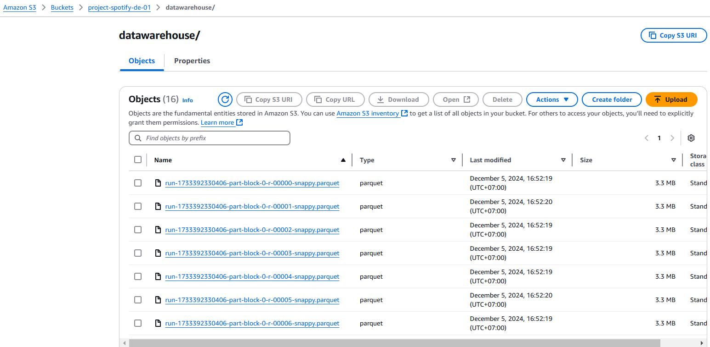

2. Create Glue ETL job to join 3 table into 1 final table for analysis.
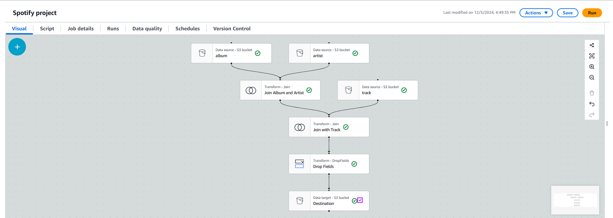
- Final result is storaged into S3DW
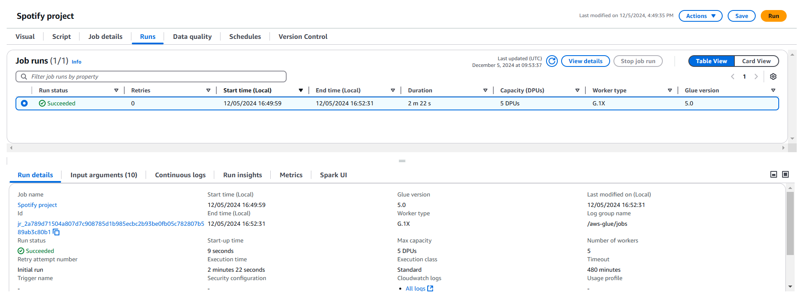

3. Create Glue Crawler to get data from S3DW to Database Athena
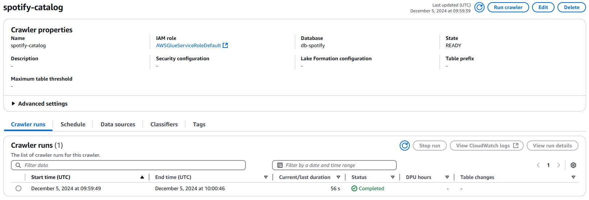
- Result after run Crawler
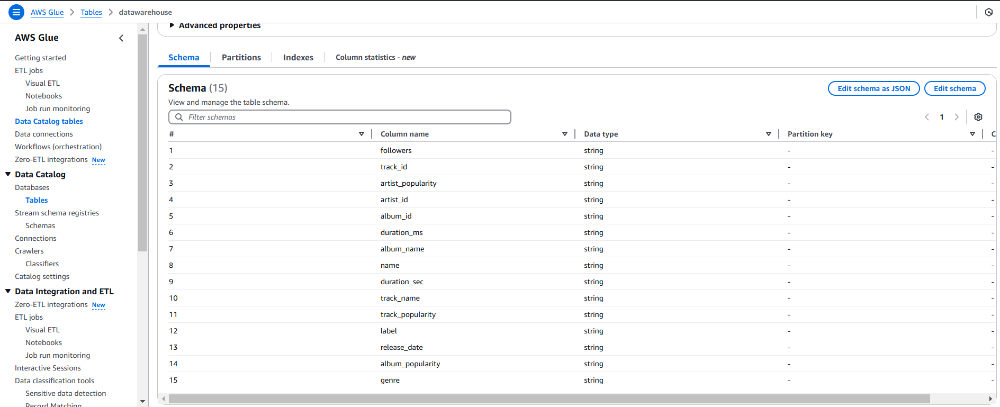

4. Query data with Athena
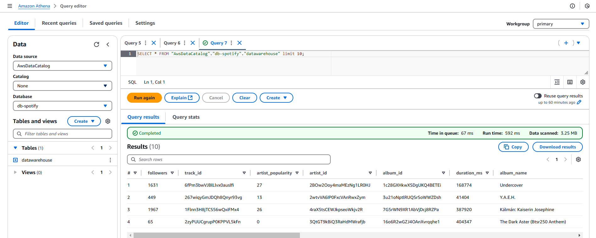

- Top 5 Genre of Artits.
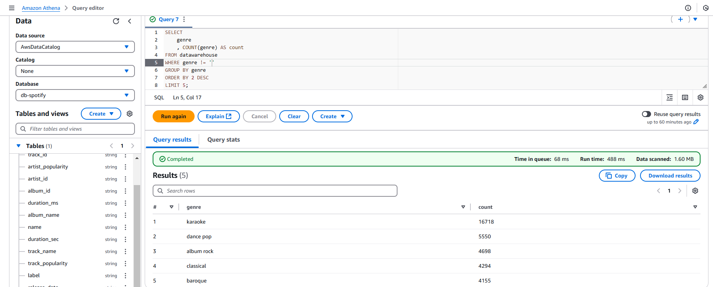

- Top 10 Albums popularity.
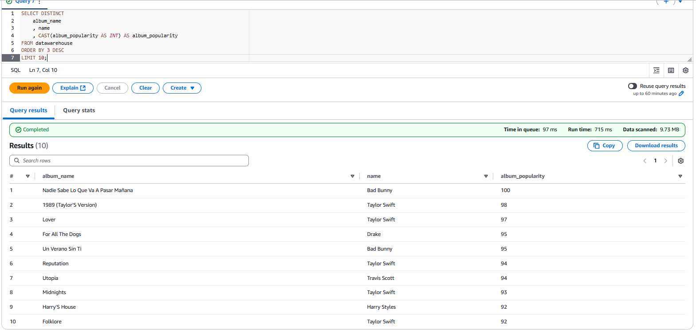

- Top 10 Artits popularity.
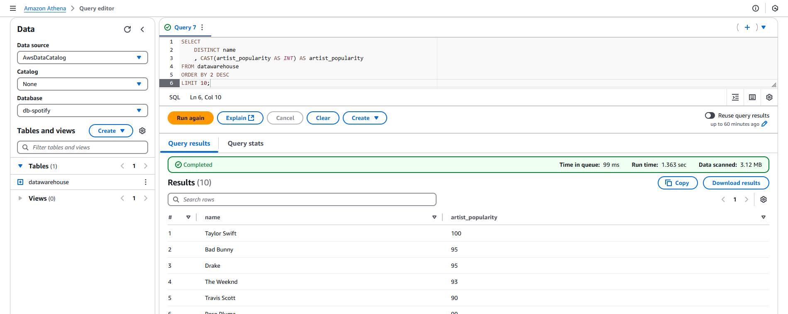

- Top 10 Tracks popularity.
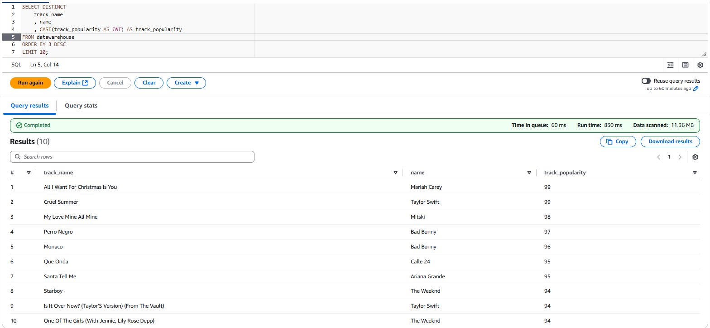

- Top 10 Number of Artirst followers.
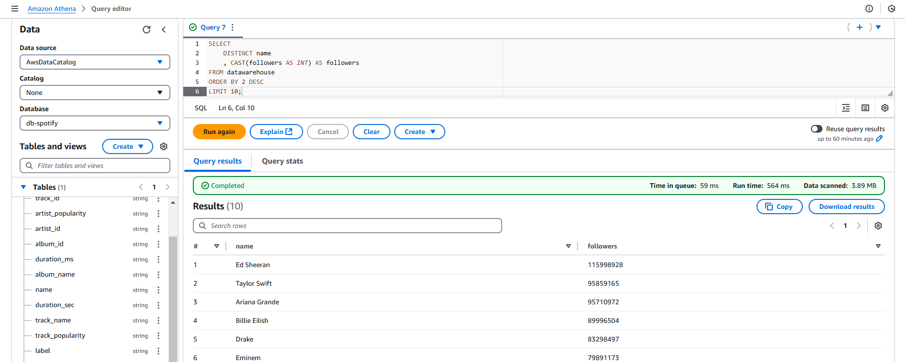

- All query result are storaged into S3 Athena output(Created before run query in Athena).
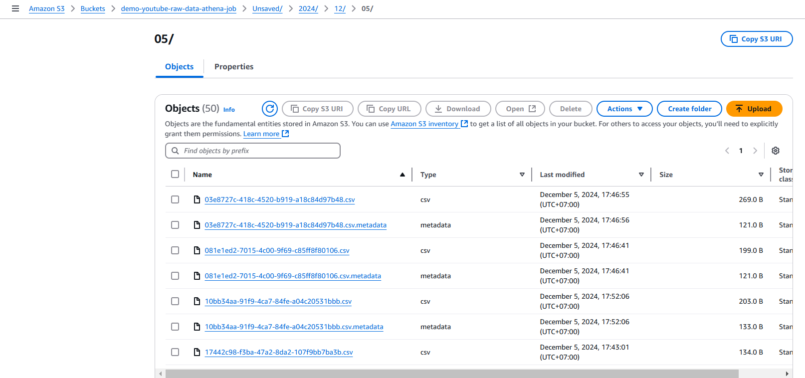

5. Data visualization with PowerBI
- Get data from csv file and create dashboard for Spotify datasets.
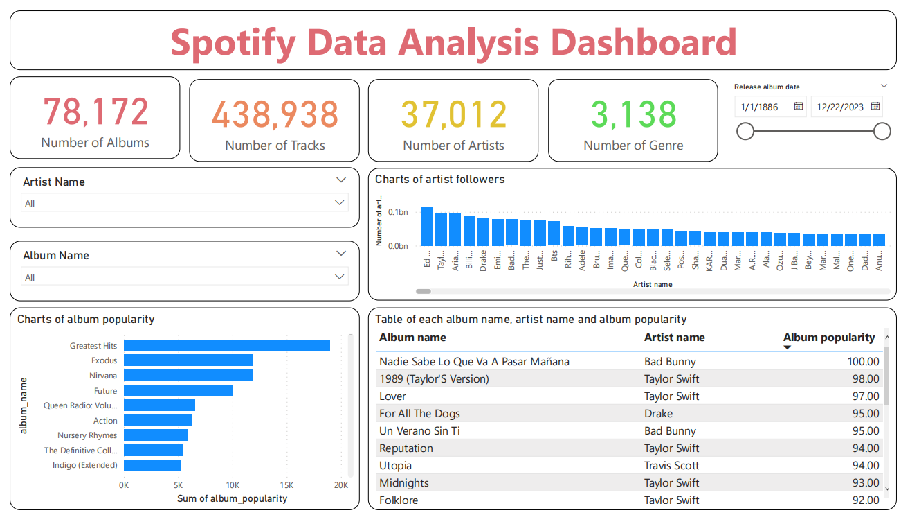

## 📨 Contact Me
- Name: Nguyễn Quang Phúc
- Gmail: nguyenquangphuc412@gmail.com